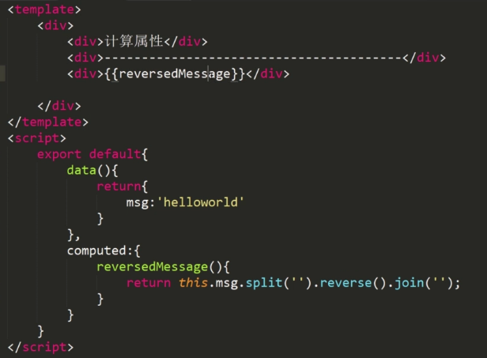
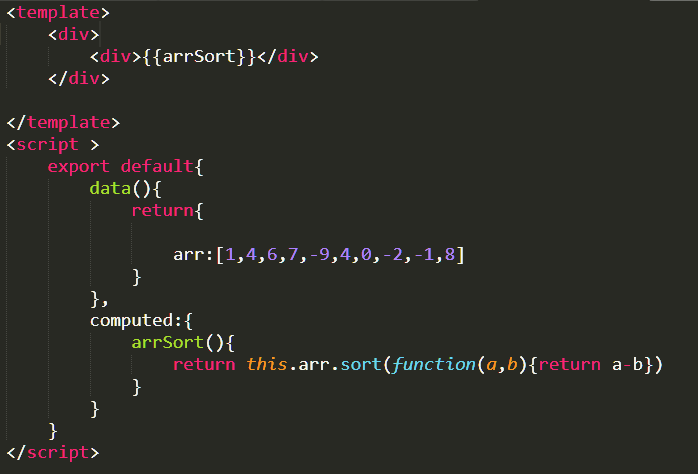
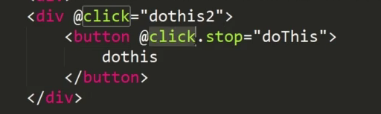
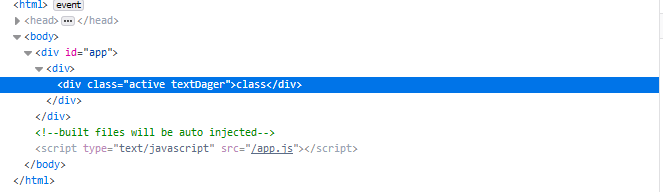
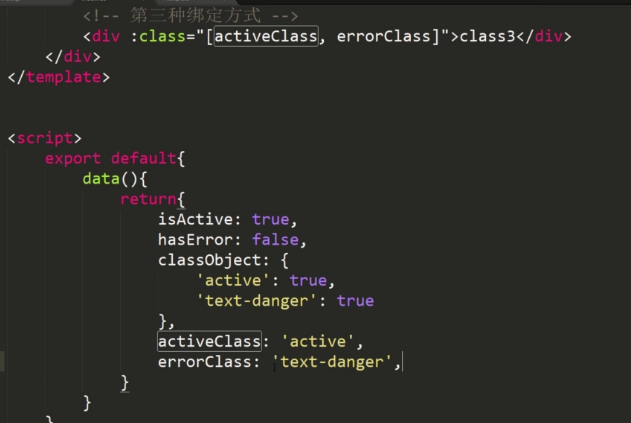
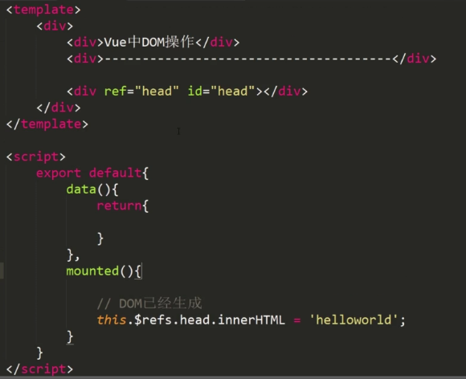

* content
{:toc}


vue把项目变成组件化开发，快速开发的特点。

生命周期
=======================
•beforeCreate    组件刚刚被创建

•created    组件创建完成

•beforeMount    挂载之前

•mounted    挂载之后

•beforeDestory    组件销毁前调用

•destoryed    组件销毁后调用

执行顺序：beforeCreate（创建前）——>created（创建后）——>beforeMount(载入前)——>mounted（载入后）——>beforeDestroy（销毁前）——>destroyed（销毁后）


模板
==============================

data(){}
---------------
放全局变量

computed ：{}
--------------
放对象，对象包含的函数；计算属性；



一个排序的计算案例：


methods ： {}
--------------
给事件用的函数，这些函数可以传参数

v-html
-------------------
v-html的内容会直接嵌套到标签内部。

v-bind
------------------
可以在标签用v-bind绑定属性，可以通过js更改属性对应的值。更加灵活了。


v-on
---------------
绑定事件

ps：v-on：click=“say（hi）” 等同于 @click=“say（hi）”

过滤器
-------------------
fitter

指令
=================

v-on
---------------
事件绑定。

下边这种嵌套情况，为了避免子元素的点击事件触发父元素，可以在子元素事件后加一个.stop



v-bind属性绑定
----------------
v-bind： 可以缩写为 ：

class的绑定：

绑定1：{ active: isActive, 'text-danger': hasError }

ps：
```html
<template>
	<div>
		<div v-bind:class="{'active':isActive,'textDager':istextDager}">class</div>
	</div>
</template>
<script >
	export default{
		data(){
			return{
				isActive:true,
				istextDager:true
			}
		},
		computed:{
		
		}
	}
</script>


```
显示是：


绑定2：classObject

```HTML
<template>
	<div>
		<div v-bind:class="classObject">class</div>
	</div>

</template>
<script >
	export default{
		data(){
			return{
				classObject:{
					'active':true,
					'text-danger':true
				}
			}
		},
		computed:{
		
		}
	}
</script>

```
显示和绑定1一样的


绑定3：[activeClass, errorClass]


style绑定：

绑定1：{ color: activeColor, fontSize: '16px' }

绑定2：styleObject

绑定3：[baseStyles, overridingStyles]

条件渲染 v-if指令和v-else指令
-----------------

如果指令为真，那么这个标签就显示。

类似的，有一个v-show，也是控制标签的显示。

列表渲染：v-for
------------------

用法1：v-for="item in items"  数组

用法2：v-for="(item, index) in items"  数组

index代表数组的下标。

用法3：v-for="(value, key) in object"  对象

表单控件绑定 v-model
--------------------------

用于实现表单内容的双向绑定。例如输入的内容可以绑定，还有选中的内容可以绑定。


自定义组件
==============================

组件的写法和普通的vue界面写法一样。只是用的时候要注意引入以及声明。

传值用：
```js
props：{
	参数：{
		type:类型
		default:默认值
		}
}

```
调用值：
```html
<component 参数=“值”> </component>
```

触发事件用：$emit(事件名)

页面自定义事件用 @事件名 =" 函数名"来调用组件里的$emit(事件名),然后触发methods里面的函数。

DOM操作
===================


mounted（挂载之后）
----------------

vue是一个虚拟的DOM，不能进行真实的DOM操作，只有在mounted下才能做DOM操作。


这里是vue中的DOM操作。

过渡
==============

```<transform name="**"></transform>```

进入状态
-----------------

enter

enter 到 enter-active 到 enter-to

离开状态
-----------------

leave

leave到 leave-active 到 leave-to

在< style> 标签里面，写法是：
```

**.leave-active{

}

**.leave-to{

}
```