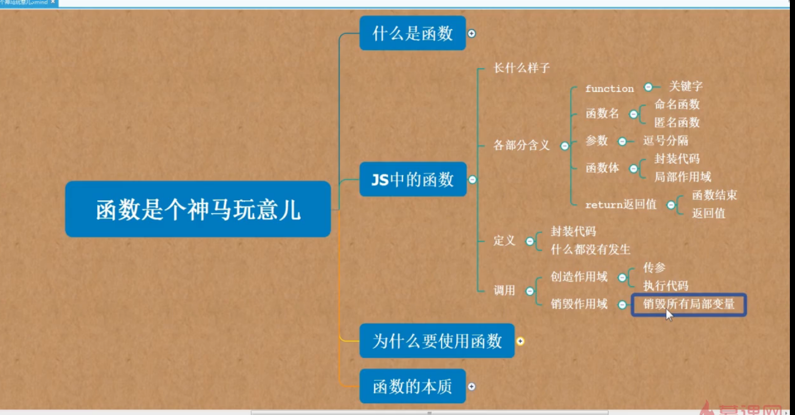
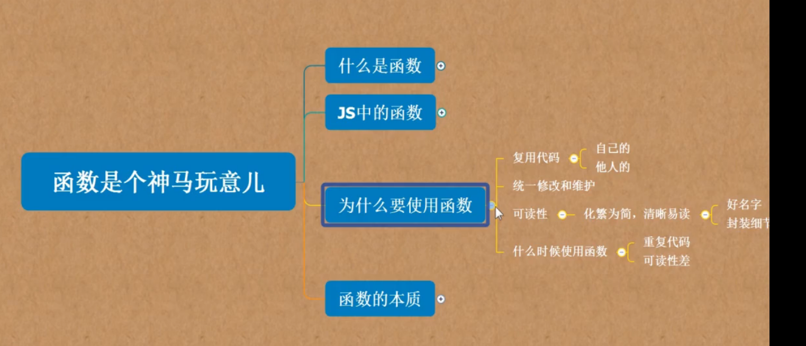
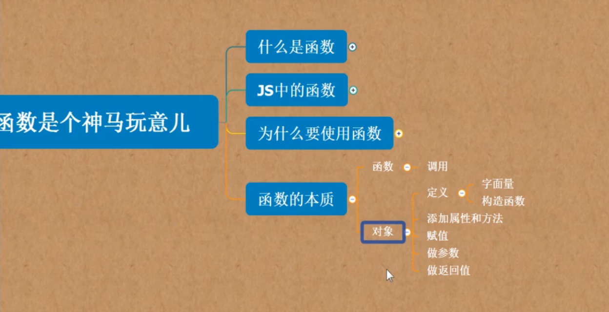
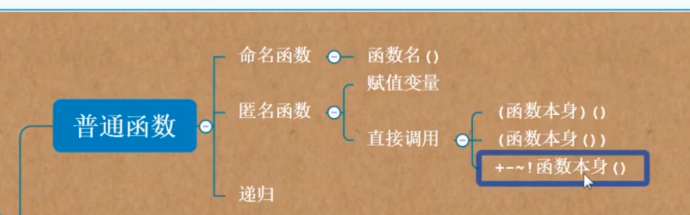
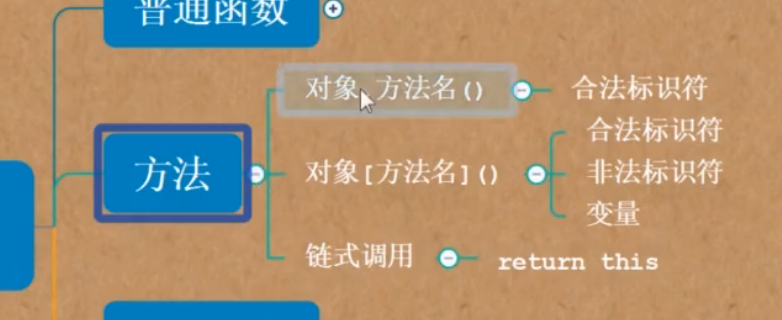
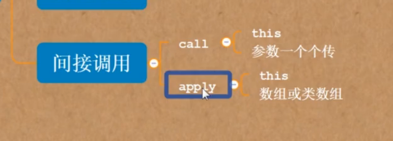
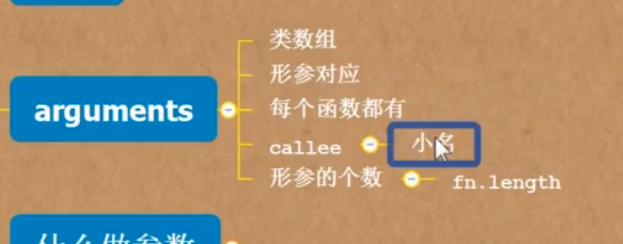
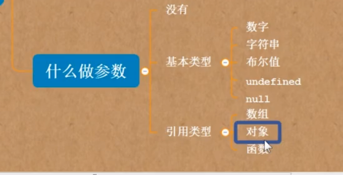

* content
{:toc}

```js
function name(参数)
{
    content
}

```








定义函数：
===================

字面量定义方式
---------------

function声明：

```js
function add(){
//body
}
add();
```
预加载的顺序对函数调用无影响

var赋值表达式：
--------------------

```js
var add =function(arg)({
//body
})
add();

var add1 =function fn(arg)({
//body
fn();
})
add1();
```
预加载对函数调用分前后

构造函数
------------------

```js
var add = new Function('num1','num2','return num1+num2')

add();
```

函数的调用
======================

普通函数
-----------
自己定义的函数

匿名函数
------------
var add = function（）{}

可以用 add（）调用；

也可以直接写 var add = function（）{}（）来调用

接下来的这些都是匿名函数
```js
(function(){
    //body
}())

(function(){
    //body
})()

!+-~function(){
    //body
}()

console.log(function(){
    //body
}());
```

传参自执行匿名函数
```js
//计算56-23
(function(num1,num2){
    console.log(num1-num2)
}(56,23))
```

递归调用
---------

和C语言一样

方法的调用
---------

```js
//典型的方法调用
var operation = {
    add:function(num1,num2){
        return num1+num2;
    },
    substract:function(num1,num2){
        return num1-num2
    },
    '@':function(){
        console.log('@');
    }
}
operation.add(1,1);//.点用来调用合法的标识符
operation['@']();//用[]调用不合法的标识符
//onclick
document.onclick= function(){
    console.log('你点击了');
}
document.onclick();//浏览器自动执行点击事件，模拟点击
//链式调用
适当用

```

构造函数的调用
----------

普通函数直接写函数名调用。构造函数要使用通过 new 函数名（）

```js

// 构造函数的方式分别定义对象和数组，并向其中添加一些内容
    function Person(){
       this.name="xiaoming";
       this.age="18";
       this.array=[];
      this.setArray=function(){
       this.array.push(12,23,23);
      }
    }
    var obj=new Person();
    obj.setArray();
    document.write(obj);
    document.write(obj.array);

```
函数调用
---------------

函数间接调用call.apply

call和apply的唯一区别就在它们传参的方式上,每个函数都有call和apply方法
```js
var name = 'xm';
var person = {};
person.name = 'xh';
person.getName = function(){
    return this.name;
}
console.log(person.getName.call(window));
console.log(person.getName.apply(window));
//传参
console.log(person.add.call(window,1,2));
console.log(person.add.apply(window,[1,2]));

```







函数中的参数
------------------------
参数传递的本质就是：形参=实参

形参个数小于实参的应用：
```js
function pow(base,power){
    power = power || 2;
    return Math.pow(base,power);
}
console.log(pow(3))//当power没传，则默认为2
console.log(pow(3,2))
```
arguments和实参指的同样的位置，
arguments.callee指代函数本身。

数组，对象都可以做参数




