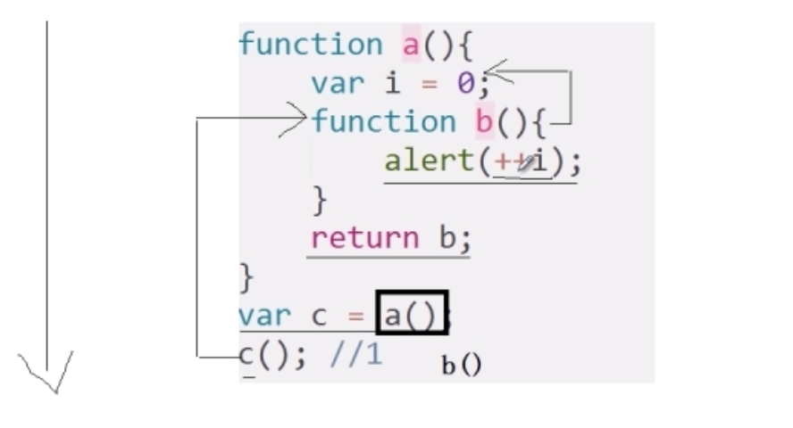

* content
{:toc}

面向对象
========

对代码的一种抽象，对外统一提供吊用接口

构造函数的typeof会打印function，而函数名 instanceof Object会打印true

js的闭包
------
闭包是一个拥有许多变量和绑定了这些变量的环境表达式（通常是一个函数）

全局定义个var变量全局变量在函数内部可以访问。

但是函数内用var定义的变量是局部变量，要想全局使用，必须省略var

闭包的优缺点：
优点：有利于封装，可以访问局部变量

缺点：内存占用浪费，很容易产生数据泄漏
